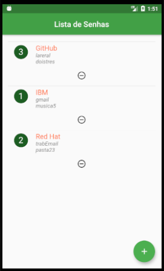
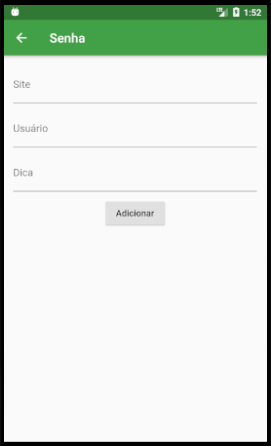

# MySenha

Aplicativo escrito em Flutter. É utilizado para guardar dicas de senhas para os diversos sites. Além disso serve como introdução para Flutter com o Banco de Dados SQFLITE pois contém um CRUD completo.

 

Nunca usar a senha real e sim uma palavra chave que o fará lembrar da senha. Por exemplo: Sopa de Letras, Botão Amarelo, Curso de Inglês.

Versão 1.0
- Permite o cadastro, alteração e remoção dos sites.
- Otimizações necessárias.
